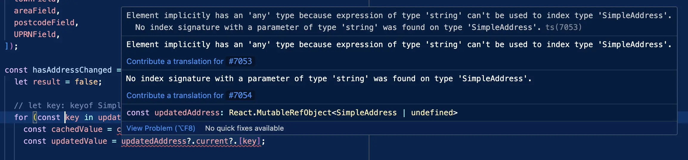

# TypeScript reminders

## Snippets

### Typed iterator key (instead of default "any" type)



```js
let key: keyof SimpleAddress;
for (key in updatedAddress.current) {
	console.log("Value: ", cachedAddress?.current?.[key]);
}
```

## Resources

**TypeScript CheatSheet:** https://github.com/typescript-cheatsheets/react#reacttypescript-cheatsheets
